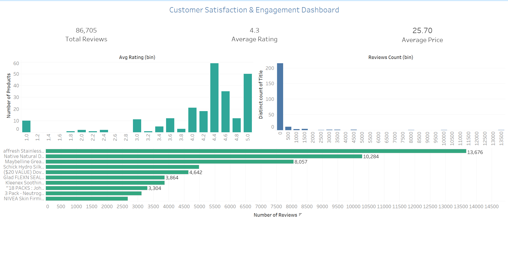
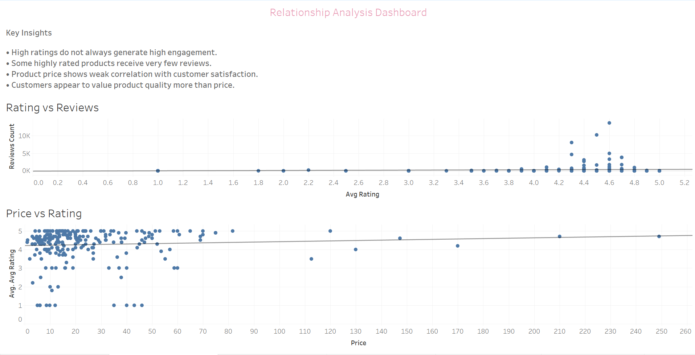
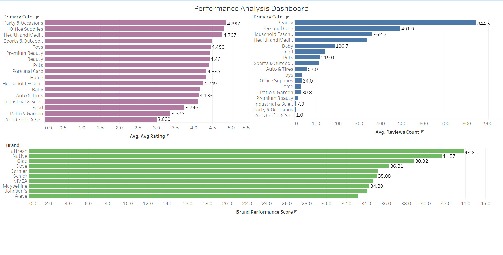
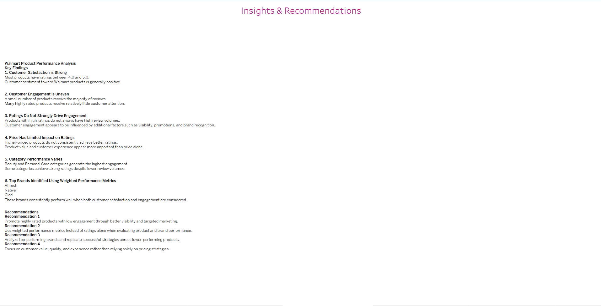

# Walmart Product Performance Analysis | Python, Tableau & Business Insights

## Project Overview

This project analyzes Walmart product performance using customer reviews, ratings, pricing information, and category-level insights.

The objective is to identify high-performing products and brands, understand customer satisfaction, analyze customer engagement patterns, and provide business recommendations through data-driven analysis.

The project combines Python for data analysis and Tableau for interactive dashboard development.

---

## Business Problem

Walmart offers thousands of products across multiple categories. Understanding what drives customer satisfaction and engagement is critical for product strategy and category management.

Business stakeholders need answers to the following questions:

* Which products receive the highest customer engagement?
* Which categories perform best?
* Do higher ratings lead to more reviews?
* Does product price influence customer ratings?
* Which brands consistently outperform competitors?

This analysis helps support product portfolio optimization and customer-centric decision-making.

---

## Dataset

The dataset contains product-level information including:

* Product Name
* Brand
* Primary Category
* Price
* Average Rating
* Review Count

---

## Tools & Technologies

### Programming & Analysis

* Python
* Pandas
* NumPy
* Jupyter Notebook

### Visualization

* Tableau

### Version Control

* Git
* GitHub

---

## Skills Demonstrated

* Exploratory Data Analysis (EDA)
* Data Cleaning & Transformation
* Product Performance Analysis
* Customer Satisfaction Analysis
* KPI Development
* Statistical Analysis
* Data Visualization
* Dashboard Design
* Business Storytelling
* Git & GitHub

---

## Key Performance Indicators (KPIs)

* Average Rating
* Total Reviews
* Average Price
* Performance Score

---

# Dashboard 1: Customer Satisfaction & Engagement

### KPIs

* Total Reviews
* Average Rating
* Average Price

### Visualizations

* Rating Distribution
* Review Distribution
* Top Products by Reviews

### Business Questions Answered

* How satisfied are customers?
* How engaged are customers?
* Which products generate the highest customer interaction?



---

# Dashboard 2: Relationship Analysis

### Visualizations

* Rating vs Reviews
* Price vs Rating

### Business Questions Answered

* Do higher ratings drive engagement?
* Does pricing influence customer satisfaction?



---

# Dashboard 3: Performance Analysis

### Visualizations

* Category Performance by Rating
* Category Performance by Review Count
* Top Brands by Performance Score

### Business Questions Answered

* Which categories perform best?
* Which brands perform best?



---

## Key Findings

* Most products received ratings between 4.0 and 5.0, indicating generally high customer satisfaction.
* Customer engagement is concentrated among a small number of products with exceptionally high review counts.
* Higher-rated products tend to receive more reviews, suggesting a positive relationship between customer satisfaction and engagement.
* Product price has a relatively weak relationship with customer ratings.
* Beauty and Personal Care categories demonstrate strong performance in both ratings and customer engagement.
* Brands such as affresh, Native, and Glad achieved the highest overall performance scores.

---

## Business Recommendations

* Prioritize investment in high-performing product categories.
* Promote products with strong ratings and high customer engagement.
* Monitor underperforming categories and identify improvement opportunities.
* Strengthen partnerships with top-performing brands.
* Leverage customer feedback and review data to improve product offerings.



---

## Repository Structure

```text
Walmart-Product-Performance-Analysis
│
├── data/
│   ├── walmart.csv
│   └── brand_performance.csv
│
├── notebooks/
│   └── walmart_product.ipynb
│
├── tableau/
│   └── Walmart_Dashboard.twb
│
├── dashboard1.png
├── dashboard2.png
├── dashboard3.png
├── recommendations.png
└── README.md
```

---

## Project Outcome

This project demonstrates how customer review data can be transformed into actionable business insights through data analysis and visualization. The dashboards enable stakeholders to evaluate customer satisfaction, identify high-performing categories and brands, and support product strategy decisions.

---

## Author

**Karan Ganapathy Areyada Aiyappa**

MSc Data Analytics
Berlin School of Business and Innovation (BSBI)

GitHub: https://github.com/Karmurphy96

LinkedIn: [www.linkedin.com/in/karan-ganapathy-a123q]
